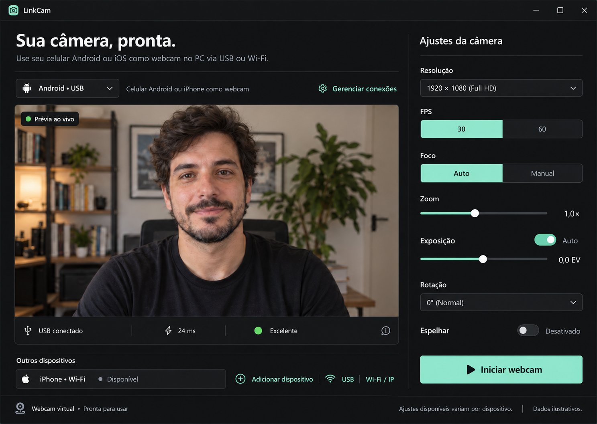

# LinkCam

Use o celular Android ou iPhone como webcam no PC, via USB ou Wi-Fi, com controle total da câmera pelo computador e compatibilidade nativa com OBS.

## Para quem

Criadores de conteúdo, streamers e quem faz chamada de vídeo e quer uma câmera muito melhor que a do notebook usando o celular que já tem.

## Funcionalidades

- Conexão por **USB** (menor latência) ou **Wi-Fi** (descoberta automática do PC)
- Até **1080p a 60 fps**
- Controle remoto pelo PC: **zoom, foco (auto/manual), exposição, troca de câmera**
- Rotação e espelhamento
- **Webcam virtual**: aparece no OBS, Zoom, Meet, Teams, Discord
- **Plugin nativo do OBS** para menor latência e várias câmeras ao mesmo tempo
- Indicador de latência e qualidade da conexão em tempo real

## Estado

Em construção. Veja o andamento em [docs/ROADMAP.md](docs/ROADMAP.md).

## Documentação

| Documento | Conteúdo |
|---|---|
| [CLAUDE.md](CLAUDE.md) | Contexto e regras para o Claude Code |
| [docs/ARQUITETURA.md](docs/ARQUITETURA.md) | Como celular, PC e OBS se conectam |
| [docs/PROTOCOLO.md](docs/PROTOCOLO.md) | Mensagens trocadas entre celular e PC |
| [docs/ROADMAP.md](docs/ROADMAP.md) | Fases de desenvolvimento |
| [docs/DESIGN.md](docs/DESIGN.md) | Sistema visual e mapa de telas |
| [docs/OBS.md](docs/OBS.md) | Estratégia de integração com OBS |
| [docs/PROMPTS.md](docs/PROMPTS.md) | Prompts prontos para cada fase |

## Pastas

- `desktop/` — app do PC (Tauri + React + Rust)
- `android/` — app Android (Kotlin)
- `ios/` — app iPhone (Swift)
- `obs-plugin/` — plugin do OBS (C)
- `protocol/` — contrato de comunicação compartilhado
