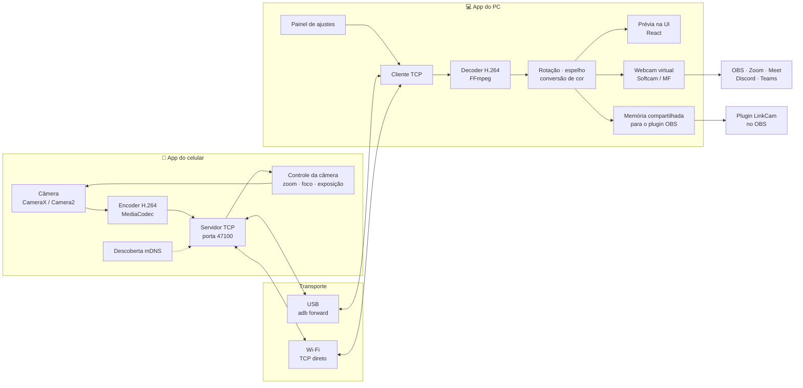

# Arquitetura

## Visão geral



## Quem é servidor e quem é cliente

Quem abre a conexão TCP muda conforme o transporte, mas depois do `HELLO` o protocolo é idêntico nos dois casos. O código de sessão nos dois apps não precisa saber qual transporte está em uso.

- **USB:** o **celular escuta** na porta 47100. O PC roda `adb forward tcp:47100 tcp:47100` e conecta em `127.0.0.1:47100`. O tráfego passa pelo cabo.
- **Wi-Fi:** o **PC escuta** na porta 47100 e se anuncia na rede por mDNS como `_linkcam._tcp` (é isso que faz "Computador encontrado — Meu PC" aparecer no celular). Quando o usuário toca em "Conectar ao PC", o celular conecta no PC.

O modo Wi-Fi também aceita digitar o IP do PC manualmente no celular, para redes que bloqueiam mDNS (redes corporativas, alguns roteadores).

> No diagrama acima, "Servidor TCP" e "Cliente TCP" representam o caso USB. No Wi-Fi os papéis de abrir a conexão se invertem.

## Fluxo de uma sessão

1. Usuário abre o app no celular e toca **Conectar ao PC**.
2. A conexão TCP abre (por USB ou Wi-Fi). Os dois lados trocam `HELLO`, e o celular manda `CAPS` (o que a câmera suporta).
3. O celular mostra o pedido "Permitir que Meu PC ajuste a câmera?". Aprovado, manda `AUTH { granted: true }` e o PC libera os controles. A escolha fica salva para aquele PC.
4. PC manda `SET_CONFIG` (resolução, fps, câmera). Celular abre a câmera e começa a mandar `VIDEO_CONFIG` (SPS/PPS) e `VIDEO_FRAME`s.
5. A cada segundo, PC manda `PING`; celular responde `PONG`. Daí sai a latência mostrada na UI ("24 ms").
6. Ajustes na UI viram `SET_ZOOM`, `SET_FOCUS`, `SET_EXPOSURE`, `SWITCH_CAMERA`. O celular aplica e confirma com `STATE`.
7. "Iniciar webcam" liga a saída da webcam virtual. "Encerrar" no celular ou fechar no PC manda `BYE`.

## Desktop por dentro

```
desktop/
├── src/                 ← UI React (TypeScript)
│   ├── screens/         ← telas (Principal, Gerenciar conexões, Ajustes)
│   ├── components/      ← Slider, Segmented, Toggle, Select, StatusBar...
│   └── lib/ipc.ts       ← chamadas ao core Rust (comandos Tauri)
└── src-tauri/           ← core em Rust
    ├── net/             ← cliente TCP, adb, mDNS, protocolo
    ├── video/           ← decoder FFmpeg, rotação, espelho
    ├── vcam/            ← webcam virtual (Softcam no Windows)
    ├── obs_bridge/      ← memória compartilhada para o plugin OBS
    └── main.rs
```

Threads do core:

- **Rede:** lê o socket, separa mensagens, manda frames para o decoder.
- **Decoder:** decodifica H.264 → frames RGBA/NV12.
- **Saída:** entrega o frame mais recente para a webcam virtual, a prévia e o plugin OBS. Se chegar frame novo antes de o anterior sair, o anterior é descartado (latência > fluidez).

A prévia na UI recebe frames reduzidos (ex: 640×360) para não pesar.

## Android por dentro

```
android/app/src/main/java/.../linkcam/
├── ui/          ← Compose: Conectar, Câmera ao vivo, Ajustes
├── camera/      ← CameraX/Camera2, aplica zoom/foco/exposição
├── encoder/     ← MediaCodec H.264 (baixa latência, I-frame a cada 2 s)
├── net/         ← servidor TCP, protocolo, mDNS (NsdManager)
└── service/     ← Foreground Service: mantém a câmera ligada com tela apagada
```

O streaming roda num **Foreground Service** com notificação, para continuar funcionando com a tela apagada ou o app em segundo plano.

## Decisões e por quê

- **H.264 e não MJPEG:** usa muito menos banda, o que segura 1080p60 no Wi-Fi. Todo celular tem encoder H.264 em hardware.
- **TCP e não UDP no começo:** mais simples e não perde pacote. Se a latência no Wi-Fi ficar ruim, a fase 7 avalia UDP com correção de erro.
- **Rotação/espelho no PC:** fazer no celular exigiria reiniciar o encoder a cada mudança.
- **adb forward no USB:** é o método mais confiável e já usado por scrcpy e DroidCam. Exige "Depuração USB" ligada, e o app ensina o usuário a ativar ("Como conectar?"). A alternativa sem depuração (Android Open Accessory) fica para o futuro.
- **Celular decide as capacidades:** cada aparelho suporta zoom, foco e exposição diferentes. O rodapé do mockup já diz isso: "Ajustes disponíveis variam por dispositivo".
