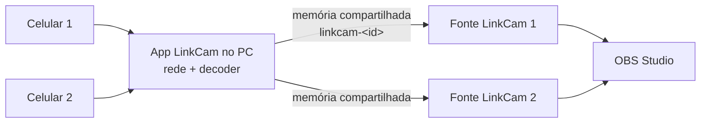

# Compatibilidade com OBS

O LinkCam chega ao OBS por dois caminhos, em fases diferentes. O primeiro funciona em qualquer programa; o segundo é feito especificamente para criadores.

## Caminho 1 — Webcam virtual (fase 2)

O app do PC registra uma câmera chamada **LinkCam** no Windows usando Softcam (DirectShow). Para o OBS ela é uma webcam comum.

**Como o usuário usa:**
1. Conecta o celular e clica em "Iniciar webcam" no LinkCam
2. No OBS: Fontes → `+` → **Dispositivo de captura de vídeo** → Dispositivo: **LinkCam**
3. Em "Resolução/Taxa de quadros", escolher "Personalizado" com a mesma resolução e FPS do LinkCam

**Vantagens:** funciona também no Zoom, Meet, Teams e Discord, e não exige instalar nada dentro do OBS.

**Limites:** uma câmera por vez; há uma cópia de frame a mais (latência um pouco maior); resolução e FPS ficam fixos depois que o OBS abre o dispositivo.

**Cuidados na implementação:**
- Manter a resolução da webcam virtual fixa durante a sessão. Se o usuário trocar de 1080p para 720p no app, o LinkCam redimensiona antes de entregar, para não quebrar o OBS.
- Quando não houver celular, entregar a imagem "Aguardando celular…" no mesmo tamanho, nunca parar de entregar frames (alguns programas travam ou mostram erro).
- O Windows 11 também aceita câmeras pela API Media Foundation. Programas novos (como o app Câmera do Windows) só enxergam câmeras desse tipo. Isso entra como melhoria depois da fase 2.

## Caminho 2 — Plugin nativo "LinkCam" (fase 5)

Um plugin instalado no OBS adiciona a fonte **LinkCam** na lista de fontes.



**Como funciona:** o app do PC continua fazendo rede e decodificação (uma implementação só). Para cada celular, ele escreve os frames numa área de memória compartilhada do Windows com nome `LinkCam_<deviceId>`. A fonte no OBS lê dessa memória e entrega o frame com `obs_source_output_video`, como fonte assíncrona.

Estrutura da memória compartilhada (proposta):
```
header (64 bytes): magic "LKCM", versão, width, height, formato (NV12),
                   índice do último frame escrito, timestamp
3 buffers de frame (triple buffering): o app escreve num, o plugin lê de outro
evento nomeado LinkCam_<deviceId>_ready sinaliza frame novo
```

**Por que é melhor para criadores:**
- **Várias câmeras:** dois ou três celulares viram duas ou três fontes no mesmo OBS (ex: rosto + mãos + cenário)
- **Menos latência:** sem passar pelo DirectShow
- **Resolução livre:** a fonte se ajusta sozinha quando a resolução muda
- **Controles dentro do OBS:** nas propriedades da fonte aparecem zoom, foco, exposição e trocar câmera, que o plugin repassa para o app (por um pipe nomeado `\\.\pipe\linkcam-control`)
- **Timestamps corretos:** o plugin passa o `pts_us` do celular convertido para o relógio do OBS, o que ajuda a sincronizar com áudio

**Como construir:** usar o `obs-plugintemplate` oficial do OBS (CMake + C). O plugin é pequeno: lê memória, entrega frame, mostra propriedades. Toda a parte difícil fica no app do PC.

## Caminho 3 — NDI (fase 7, opcional)

O app do PC também pode publicar cada câmera como fonte NDI na rede. O OBS (com o plugin DistroAV), vMix e outros programas de produção enxergam sem configuração. Útil para quem tem PC de stream separado do PC de jogo.

## Testes de compatibilidade

Lista para conferir antes de cada versão:

- [ ] OBS: Dispositivo de captura de vídeo → LinkCam, 1080p30 e 1080p60
- [ ] OBS: fechar e reabrir o LinkCam com o OBS aberto (a fonte deve voltar sozinha)
- [ ] OBS: celular desconectado mostra "Aguardando celular…"
- [ ] Google Meet (navegador), Zoom, Discord, Teams
- [ ] Plugin: duas fontes LinkCam com dois celulares
- [ ] Plugin: trocar resolução no meio da cena
