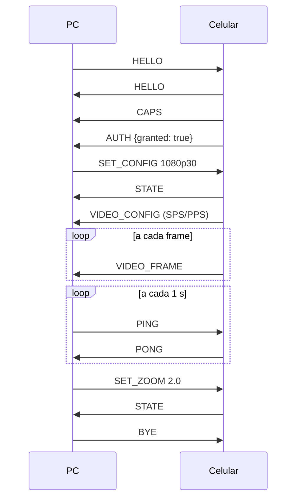

# Protocolo LinkCam — versão 1

Contrato entre o app do celular e o app do PC. Os números (tipos, porta, versão) também estão em `protocol/linkcam-protocol.json`, que é a referência para gerar constantes em Kotlin, Rust e Swift.

## Transporte

- **TCP**, porta padrão **47100**
- USB: `adb forward tcp:47100 tcp:47100`, PC conecta em `127.0.0.1:47100`
- Wi-Fi: PC escuta em `0.0.0.0:47100` e se anuncia via mDNS `_linkcam._tcp.local.` com TXT `name=<nome do PC>`, `ver=1`
- Uma única conexão carrega controle e vídeo
- `TCP_NODELAY` ligado nos dois lados (sem isso o sistema segura pacotes pequenos e a latência sobe)

## Formato de cada mensagem

Toda mensagem tem um cabeçalho fixo de **6 bytes**, seguido do conteúdo:

```
┌────────┬────────┬────────────────────┬──────────────────┐
│ type   │ flags  │ length             │ payload          │
│ 1 byte │ 1 byte │ 4 bytes big-endian │ `length` bytes   │
└────────┴────────┴────────────────────┴──────────────────┘
```

- Mensagens de **controle** têm payload em **JSON UTF-8**
- Mensagens de **vídeo** e **ping** têm payload **binário** (descrito em cada uma)
- Tamanho máximo de payload: 8 MB. Acima disso, encerrar a conexão (dado corrompido)

## Tabela de mensagens

| Tipo | Nome | Direção | Payload |
|---|---|---|---|
| `0x01` | HELLO | ambos | JSON |
| `0x02` | CAPS | celular → PC | JSON |
| `0x03` | AUTH | celular → PC | JSON |
| `0x10` | SET_CONFIG | PC → celular | JSON |
| `0x11` | SET_ZOOM | PC → celular | JSON |
| `0x12` | SET_FOCUS | PC → celular | JSON |
| `0x13` | SET_EXPOSURE | PC → celular | JSON |
| `0x14` | SWITCH_CAMERA | PC → celular | JSON |
| `0x15` | SET_TORCH | PC → celular | JSON |
| `0x16` | REQUEST_KEYFRAME | PC → celular | vazio |
| `0x20` | STATE | celular → PC | JSON |
| `0x21` | ERROR | ambos | JSON |
| `0x30` | PING | PC → celular | binário |
| `0x31` | PONG | celular → PC | binário |
| `0x40` | VIDEO_CONFIG | celular → PC | binário |
| `0x41` | VIDEO_FRAME | celular → PC | binário |
| `0x50` | AUDIO_CONFIG | celular → PC | reservado (fase 7) |
| `0x51` | AUDIO_FRAME | celular → PC | reservado (fase 7) |
| `0xFF` | BYE | ambos | JSON opcional |

Tipo desconhecido: ignorar a mensagem (pular `length` bytes) e seguir. Isso permite que versões novas conversem com versões antigas.

## Mensagens de controle

### HELLO (0x01)

Primeira mensagem dos dois lados. Se `protocol` for diferente, quem recebe manda `ERROR` com `code: "version_mismatch"` e fecha.

```json
{
  "protocol": 1,
  "app": "linkcam-desktop",
  "appVersion": "0.1.0",
  "deviceName": "Meu PC",
  "deviceId": "b7f2c1e0-..."
}
```

`deviceId` é um UUID gerado na primeira execução e salvo. Serve para o celular lembrar que já autorizou aquele PC.

### CAPS (0x02)

O celular informa o que cada câmera suporta. O PC monta a UI a partir disso: controle que não vem aqui não aparece.

```json
{
  "cameras": [
    {
      "id": "0",
      "facing": "back",
      "label": "Traseira",
      "resolutions": [
        { "width": 1920, "height": 1080, "fps": [30, 60] },
        { "width": 1280, "height": 720, "fps": [30, 60] }
      ],
      "zoom": { "min": 1.0, "max": 8.0 },
      "focus": { "modes": ["auto", "manual"], "manualMin": 0.0, "manualMax": 10.0 },
      "exposure": { "min": -2.0, "max": 2.0, "step": 0.1 },
      "torch": true
    },
    {
      "id": "1",
      "facing": "front",
      "label": "Frontal",
      "resolutions": [{ "width": 1920, "height": 1080, "fps": [30] }],
      "zoom": { "min": 1.0, "max": 1.0 },
      "focus": { "modes": ["auto"] },
      "exposure": { "min": -2.0, "max": 2.0, "step": 0.1 },
      "torch": false
    }
  ],
  "encoder": { "codecs": ["h264"], "maxBitrateKbps": 20000 }
}
```

### AUTH (0x03)

Resposta do usuário ao pedido de permissão no celular. Até chegar `granted: true`, o celular ignora comandos `SET_*` (mas pode mandar vídeo).

```json
{ "granted": true, "remember": true }
```

### SET_CONFIG (0x10)

Configura câmera, resolução e qualidade. O celular reinicia o encoder se necessário e responde com `STATE`.

```json
{
  "cameraId": "0",
  "width": 1920,
  "height": 1080,
  "fps": 30,
  "bitrateKbps": 8000
}
```

Bitrate sugerido: 720p30 = 4000, 1080p30 = 8000, 1080p60 = 12000 (USB pode ir mais alto).

### SET_ZOOM (0x11)

```json
{ "value": 1.5 }
```

### SET_FOCUS (0x12)

```json
{ "mode": "auto" }
{ "mode": "manual", "value": 3.2 }
{ "mode": "tap", "x": 0.5, "y": 0.4 }
```

`tap` foca num ponto da imagem (x e y de 0 a 1). Permite clicar na prévia do PC para focar.

### SET_EXPOSURE (0x13)

```json
{ "auto": true }
{ "auto": false, "ev": -0.7 }
```

### SWITCH_CAMERA (0x14)

```json
{ "cameraId": "1" }
```

### SET_TORCH (0x15)

```json
{ "on": true }
```

### STATE (0x20)

Estado atual da câmera. O celular manda sempre que algo muda (por comando do PC **ou** por toque no próprio celular), para os dois lados ficarem sincronizados.

```json
{
  "cameraId": "0",
  "width": 1920, "height": 1080, "fps": 30, "bitrateKbps": 8000,
  "zoom": 1.0,
  "focus": { "mode": "auto" },
  "exposure": { "auto": true, "ev": 0.0 },
  "torch": false,
  "battery": { "level": 82, "charging": true },
  "temperatureWarning": false
}
```

`battery` e `temperatureWarning` servem para o PC avisar o criador antes de o celular desligar ou esquentar no meio da live.

### ERROR (0x21)

```json
{ "code": "camera_busy", "message": "Outra aplicação está usando a câmera" }
```

Códigos: `version_mismatch`, `not_authorized`, `camera_busy`, `unsupported_config`, `encoder_failed`, `internal`.

### BYE (0xFF)

```json
{ "reason": "user_closed" }
```

## Mensagens binárias

### PING (0x30) / PONG (0x31)

PING: 8 bytes, `t_pc` = relógio monotônico do PC em microssegundos (u64 big-endian).
PONG: devolve os mesmos 8 bytes.

Latência mostrada na UI = `(agora - t_pc) / 2`, média das últimas 5 medições. Qualidade:

| Latência | Rótulo na UI |
|---|---|
| < 50 ms | Excelente |
| 50–120 ms | Boa |
| 120–250 ms | Instável |
| > 250 ms ou PONG atrasado 3× | Ruim |

### VIDEO_CONFIG (0x40)

Enviada ao iniciar o encoder e sempre que ele reinicia.

```
codec        1 byte   (1 = H.264)
width        2 bytes  big-endian
height       2 bytes  big-endian
fps          1 byte
orientation  2 bytes  rotação do sensor em graus (0, 90, 180, 270)
config_len   4 bytes  big-endian
config       SPS + PPS em formato Annex-B (começando com 00 00 00 01)
```

### VIDEO_FRAME (0x41)

```
flags do cabeçalho: bit 0 = keyframe
pts_us   8 bytes  big-endian, timestamp de captura em microssegundos
data     restante, uma unidade de acesso H.264 em Annex-B
```

Encoder configurado para baixa latência: perfil Baseline ou Main, sem B-frames, keyframe a cada 2 s. Quando o PC perde sincronia (decoder com erro), manda `REQUEST_KEYFRAME`.

## Sequência típica


